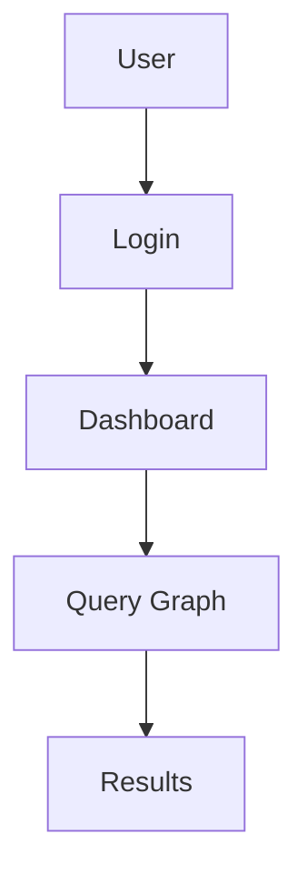

# Graphify

Build knowledge graphs for LLM applications. Knowledge graphs improve AI responses by providing structured context with relationships, enable retrieval-augmented generation with graph traversal, and support agentic workflows with graph-defined tools.

## When to Use

- Building knowledge bases with relationships (not just chunks)
- Implementing Graph RAG for better recall
- Extracting structure from unstructured documents
- Building agent memories with relationships
- Creating recommendation systems
- Analyzing code dependencies

---

## 1. Graph Storage Selection

Choose storage based on query patterns and scale requirements.

### In-Memory Graph

Use for: prototyping, small graphs (<10K nodes), single-machine apps

```typescript
// Example: GraphLib or native Map/Set
const graph = new Map<string, Set<string>>();
```

### PostgreSQL with Extensions

Use when: already using PostgreSQL, need ACID compliance, moderate scale

- **pggraph**: Native graph support via extensions
- Works with existing Postgres infrastructure

### Neo4j

Use when: complex relationship queries, Cypher proficiency, managed needed

- Best for: traversals, path finding, graph algorithms
- Avoid if: simple queries dominate

### Redis

Use when: caching, real-time, ephemeral graphs

- Best for: session graphs, rate limiting, recent activity

### AWS Neptune

Use when: managed, need Gremlin/SPARQL, AWS ecosystem

- Serverless option available
- Integration with AWS services

**Decision Matrix:**

| Scenario | Recommended |
|----------|-------------|
| Prototyping | In-memory |
| Already on Postgres | PostgreSQL |
| Complex traversals | Neo4j |
| Caching/real-time | Redis |
| Managed AWS | Neptune |
| Knowledge base | Neo4j or PostgreSQL |

---

## 2. Graph Algorithms

Select algorithm based on the question you're answering.

### Traversal (BFS/DFS)

Use for: exploration, finding any path, connectivity

- **BFS**: Shortest unweighted path, level-by-level
- **DFS**: Deep exploration, cycle detection

```typescript
// BFS for shortest path
function bfs(graph, start, goal) {
  const queue = [[start]];
  const visited = new Set([start]);
  while (queue.length) {
    const path = queue.shift();
    const node = path[path.length - 1];
    if (node === goal) return path;
    for (const neighbor of graph.get(node) || []) {
      if (!visited.has(neighbor)) {
        visited.add(neighbor);
        queue.push([...path, neighbor]);
      }
    }
  }
}
```

### Shortest Path (Dijkstra, A*)

Use for: weighted routing, travel time, cost optimization

### Centrality Measures

Use for: identifying important nodes

- **PageRank**: Importance via links/votes
- **Betweenness**: Bridge identification
- **Degree**: Direct influence

### Community Detection

Use for: clustering, segmentation

- **Louvain**: Large-scale community detection
- **Label Propagation**: Fast clustering

**When to Use Each:**

| Question | Algorithm |
|----------|-----------|
| How do I get from A to B? | BFS/Dijkstra |
| What's the best order? | Topological sort |
| What's most important? | PageRank |
| Who are the bridges? | Betweenness |
| What groups exist? | Louvain |

---

## 3. Graph Extraction Sources

Extract graphs from different data sources.

### From Documents (PDF, Markdown)

Process: chunk → extract entities → extract relationships

```typescript
// Extract entities from text chunk
prompt = `Extract entities from: {chunk}
Entities as JSON: { "entities": [{"id": "...", "type": "...", "name": "..."}] }`;
```

### From Code (AST Parsing)

Extract: imports, function calls, class relationships

```typescript
// Dependency graph from imports
imports.map(file => ({
  source: file.path,
  targets: file.imports,
  type: 'imports'
}));
```

### From Websites

Link graphs from HTML parsing

```typescript
// Extract links
links = html.querySelectorAll('a[href]')
  .map(a => ({ source: pageUrl, target: a.href, type: 'links_to' }));
```

### From SQL

Schema graphs: tables, columns, foreign keys

```typescript
// Extract schema relationships
foreignKeys.map(fk => ({
  source: fk.fromTable,
  target: fk.toTable,
  type: 'references',
  via: fk.column
}));
```

### From JSON/YAML

Configuration graphs

```typescript
// Dependencies from package.json
deps.map(d => ({ source: 'package', target: d.name, type: 'depends_on' }));
```

---

## 4. LLM Graph Construction

Build graphs using LLMs for entity and relationship extraction.

### Entity Extraction Prompt

```prompt
Extract all entities from the following text.
For each entity, provide: id, type, name, description.

Text: {text}

Output as JSON array:
```

### Relationship Extraction Prompt

```prompt
Extract relationships between these entities.
For each relationship: source, target, type, confidence (0-1).

Entities: {entities}

Relationships:
```

### Relationship Confidence

- Use LLM to provide confidence scores
- Filter by threshold (e.g., confidence > 0.7)
- Allow incremental updating

### Semantic Search with Embeddings

```typescript
// Embed entities for semantic search
entities.forEach(entity => {
  entity.embedding = embed(entity.name + ' ' + entity.description);
});

// Query: find similar entities
similar = vectorSearch(queryEmbedding, entities, topK: 10);
```

### Incremental Graph Building

1. Process new document
2. Extract entities (match existing → link, new → add)
3. Extract relationships (add/update)
4. Update embeddings

---

## 5. LLM Graph Integration

Use graphs with LLMs for improved retrieval.

### Graph RAG Pattern

```prompt
Context from knowledge graph:
{graph_context}

Question: {question}

Based on the graph context above, answer:
```

**Graph retrieval steps:**
1. Convert question to graph query
2. Traverse relevant subgraphs
3. Include relationship context in prompt

### Graph Tools for Agents

Define tools from graph structure:

```typescript
// Graph-defined tools
const tools = graph.nodes.map(node => ({
  name: `query_${node.type}`,
  description: `Query ${node.type} entities`,
  parameters: { ... }
}));
```

### Subagent Orchestration via Graph

```typescript
// Route through graph
function orchestrate(query, graph) {
  const relevant = graph.query(query);
  const agent = selectAgent(relevant.type);
  return agent.execute(query, relevant.context);
}
```

**Hybrid RAG: Vector + Graph**

| Approach | Best For |
|----------|----------|
| Vector only | Similarity search |
| Graph only | Relationship queries |
| Hybrid | Both similarity + relationships |

Execute both, combine results.

---

## 6. Graph Visualization

Choose visualization based on context.

### Mermaid

For documentation, README files:



### D3.js

For interactive web applications:

```typescript
// D3 force-directed graph
const simulation = d3.forceSimulation(nodes)
  .force('link', d3.forceLink(links).id(d => d.id))
  .force('charge', d3.forceManyBody())
  .force('center', d3.forceCenter(width / 2, height / 2));
```

### Graphviz (DOT)

For static diagrams:

```
digraph {
  User -> Login -> Dashboard
  Dashboard -> Query
  Query -> Graph
}
```

**Selection Guide:**

| Context | Recommended |
|--------|-------------|
| Documentation | Mermaid |
| Web app | D3.js |
| Static analysis | Graphviz |
| CLI output | ASCII |

---

## Process Summary

### Step 1: Choose Storage

Start simple, upgrade as needed

### Step 2: Extract Graph

- From documents → chunk + LLM extraction
- From code → AST parsing
- From existing data → schema extraction

### Step 3: Build Incrementally

- Process documents
- Deduplicate entities
- Add relationships
- Update embeddings

### Step 4: Integrate with LLM

- Graph RAG for retrieval
- Graph tools for agents

### Step 5: Visualize

As needed for debugging/documentation

---

## Common Mistakes

| Mistake | Reality |
|---------|--------|
| "Start with Neo4j" | Start in-memory, upgrade when needed |
| "Extract everything" | Focus on useful relationships |
| "Graph replaces vector" | Use hybrid approach |
| "One-time build" | Graphs need maintenance |

---

## Verification

- [ ] Graph storage selected based on query patterns
- [ ] Algorithm chosen for actual questions
- [ ] Extraction working from primary sources
- [ ] Entity/relationship extraction prompts defined
- [ ] Graph RAG pattern implemented
- [ ] Visualization working for debugging