# AI Engineering System

Advanced development tools with context engineering, research orchestration, and 29 specialized agents for Claude Code & OpenCode.

## 🚀 Quick Start

### Spec-Driven Development (Recommended)

This toolkit follows the **spec-driven development methodology** from GitHub's official blog post: [Spec-driven development with AI: Get started with a new open source toolkit](https://github.blog/ai-and-ml/generative-ai/spec-driven-development-with-ai-get-started-with-a-new-open-source-toolkit/).

**The 5-Phase Workflow** (always in this order):

```mermaid
flowchart LR
    A[🎯 Research] --> B[📋 Specify] --> C[📝 Plan] --> D[🔨 Work] --> E[🔍 Review]
    D -.->|If changes needed| E
    E -.->|Repeat| D
```



| Phase | Command | Output |
|-------|---------|--------|
| 1. Research | `/ai-eng/research` | Context and findings |
| 2. Specify | `/ai-eng/specify` | Feature specification |
| 3. Plan | `/ai-eng/plan` | Implementation plan |
| 4. Work | `/ai-eng/work` | Quality-gated code |
| 5. Review | `/ai-eng/review` | Multi-agent approval |

This approach ensures specifications are your "source of truth" for what gets built, reducing guesswork and enabling more reliable AI-assisted development.

See [docs/spec-driven-workflow.md](./docs/spec-driven-workflow.md) for complete workflow guide with examples.

### Claude Code (Recommended)
```bash
/plugin marketplace add v1truv1us/ai-eng-system
/plugin install ai-eng-system@ai-eng-marketplace
```

### OpenCode
```bash
# Add to opencode.jsonc:
{
  "$schema": "https://opencode.ai/config.json",
  "plugin": ["opencode-skills", "ai-eng-system"]
}

# Run OpenCode - plugin auto-installs commands, agents, and skills
```
## 📋 What's Included

### Spec-Driven Development Workflow

**Core workflow for systematic development** (always research → specify → plan → work → review):

| Phase | Command | Purpose |
|-------|---------|---------|
| 1. Research | `/ai-eng/research` | Multi-phase research with codebase and external context |
| 2. Specify | `/ai-eng/specify` | Create feature specifications with TCRO framework |
| 3. Plan | `/ai-eng/plan` | Create detailed implementation plans from specs |
| 4. Work | `/ai-eng/work` | Execute plans with quality gates and validation |
| 5. Review | `/ai-eng/review` | Multi-perspective code review (29 agents) |

> **Methodology**: Based on [GitHub's spec-driven development approach](https://github.blog/ai-and-ml/generative-ai/spec-driven-development-with-ai-get-started-with-a-new-open-source-toolkit/)

### Additional Commands (12 total)
- `/ai-eng/optimize` - Prompt enhancement (+45% quality)
- `/ai-eng/deploy` - Pre-deployment checklists
- `/ai-eng/compound` - Document solved problems
- `/ai-eng/recursive-init` - Initialize AGENTS.md across directories
- `/ai-eng/create-plugin` - AI-assisted plugin creation
- `/ai-eng/create-agent` - AI-assisted agent generation
- `/ai-eng/create-command` - AI-assisted command generation
- `/ai-eng/create-skill` - AI-assisted skill creation
- `/ai-eng/create-tool` - AI-assisted custom tool creation
- `/ai-eng/context` - Context management and retrieval
- `/ai-eng/clean` - Remove build artifacts and generated files
- `/ai-eng/seo` - SEO audits with Core Web Vitals

**Total Commands**: 17

### Agents (29 total)
- **Architecture & Planning**: `architect-advisor`, `backend-architect`, `infrastructure-builder`
- **Development & Coding**: `frontend-reviewer`, `full-stack-developer`, `api-builder-enhanced`, `database-optimizer`, `java-pro`
- **Quality & Testing**: `code-reviewer`, `test-generator`, `security-scanner`, `performance-engineer`
- **DevOps & Deployment**: `deployment-engineer`, `monitoring-expert`, `cost-optimizer`
- **AI & Machine Learning**: `ai-engineer`, `ml-engineer`
- **Content & SEO**: `seo-specialist`, `prompt-optimizer`
- **Plugin Development**: `agent-creator`, `command-creator`, `skill-creator`, `tool-creator`, `plugin-validator`

### Skills (13 files)
- `devops` - Coolify deployment, Git worktree workflows
- `prompting` - Research-backed incentive prompting techniques
- `research` - Comprehensive multi-phase research orchestration
- `plugin-dev` - Plugin development knowledge base and references
- `text-cleanup` - Pattern-based text cleanup (slop, comments)

## 🏗️ Architecture

This repo follows Anthropic's official Claude Code marketplace pattern:

- **Marketplace root**: `.claude-plugin/marketplace.json` (only file at repo root)
- **Embedded plugin**: `plugins/ai-eng-system/` with standard plugin layout
- **Build system**: Transforms canonical `content/` sources into platform-specific outputs
- **OpenCode support**: Pre-built distributions in `dist/.opencode/`
- **Auto-installation**: Plugin automatically installs files when loaded by OpenCode or via npm postinstall


## 🔧 Development

### Prerequisites
- Bun >= 1.0.0
- Node.js >= 18 (for compatibility)

### Build & Test
```bash
bun run build        # Build all platforms
bun run build:watch  # Watch mode
bun run validate     # Validate content without building
bun test             # Run test suite
```

### Repository Structure
```
├── content/          # Canonical markdown sources
│   ├── commands/     # Command definitions
│   └── agents/       # Agent definitions
├── skills/           # Skill packs
├── plugins/          # Embedded Claude plugin
├── dist/             # Built outputs (committed)
├── .claude-plugin/   # Marketplace manifest
└── .opencode/        # OpenCode config
```

## 📦 Distribution

### Claude Code Marketplace
- **Source**: `https://github.com/v1truv1us/ai-eng-system`
- **Marketplace**: `v1truv1us/ai-eng-marketplace`
- **Plugin**: `ai-eng-system`

### OpenCode
- **Global**: `~/.config/opencode/` (default)
- **Local**: `./.opencode/` (project-specific)
- **Namespace**: `ai-eng/`

## ✅ Validation Status
- Marketplace manifest: ✅ Valid
- Embedded plugin: ✅ Valid
- Build system: ✅ Working
- Tests: ✅ Passing (21/21)

## 📚 Documentation
- [Installation Guide](INSTALLATION.md) - Detailed setup instructions
- [Agent Coordination](AGENTS.md) - Agent usage patterns and coordination
- [Plugin Documentation](PLUGIN.md) - Technical plugin details
- [Research Guide](docs/research-command-guide.md) - Research orchestration usage

---
## 💻 Usage Example

### OpenCode Setup

```bash
# 1. Create opencode.jsonc in your project
cat > opencode.jsonc << 'EOF'
{
  "$schema": "https://opencode.ai/config.json",
  "plugin": ["opencode-skills", "ai-eng-system"]
}
EOF

# 2. Install package (optional - auto-installs via plugin)
npm install ai-eng-system

# 3. Run OpenCode
# Commands and agents are automatically available!
```

**When OpenCode loads the plugin**, it automatically:
- ✅ Installs 16 commands to `.opencode/command/ai-eng/`
- ✅ Installs 30 agents to `.opencode/agent/ai-eng/`
- ✅ Installs 13 skill files to `.opencode/skills/`

### Using Commands

```bash
/ai-eng/plan              # Create implementation plan
/ai-eng/review             # Multi-agent code review
/ai-eng/work               # Execute implementation plan
/ai-eng/seo                # SEO audit
/ai-eng/create-agent       # Generate new agent
# ... and 11 more
```

### Using Agents

Commands reference specialized agents automatically:
```bash
/ai-eng/review --agent=code-reviewer     # Quality-focused review
/ai-eng/review --agent=frontend-reviewer # Frontend review
/ai-eng/review --agent=backend-architect  # Architecture review
```

**Built with research-backed prompting techniques** (+45-115% quality improvement)

## 📖 Workflow Guide

For complete documentation on the **Research → Specify → Plan → Work → Review** workflow, see:
- **[docs/spec-driven-workflow.md](./docs/spec-driven-workflow.md)** - Visual workflow guide with examples
- **[docs/research-command-guide.md](./docs/research-command-guide.md)** - Research command deep dive