# Spec-Driven Development Workflow Guide

This guide documents the complete **Research → Specify → Plan → Work → Review** workflow for systematic AI-assisted development.

This guide documents the complete **Research → Specify → Plan → Work → Review** workflow for systematic AI-assisted development.

## Visual Workflow

```mermaid
flowchart TD
    A[🎯 Start: Research] -->|/ai-eng/research| B[📋 Specify]
    B -->|/ai-eng/specify| C[📝 Plan]
    C -->|/ai-eng/plan| D[🔨 Work]
    D -->|/ai-eng/work| E[🔍 Review]
    
    E -->|If changes needed| D
    E -->|Approved| F[✅ Complete]
    
    B -.->|Feed research| B
    C -.->|Feed spec| C
    D -.->|Feed plan| D
    
    subgraph "Phase 1: Research"
        A
    end
    
    subgraph "Phase 2: Specify"
        B
    end
    
    subgraph "Phase 3: Plan"
        C
    end
    
    subgraph "Phase 4: Work"
        D
    end
    
    subgraph "Phase 5: Review"
        E
    end
```



## Workflow Phases

| Phase | Command | Output | Feeds Into |
|-------|---------|--------|------------|
| **1. Research** | `/ai-eng/research` | Research findings in `docs/research/` | → Specify |
| **2. Specify** | `/ai-eng/specify` | Feature spec in `specs/[feature]/spec.md` | → Plan |
| **3. Plan** | `/ai-eng/plan` | Implementation plan in `specs/[feature]/plan.md` | → Work |
| **4. Work** | `/ai-eng/work` | Implemented features with quality gates | → Review |
| **5. Review** | `/ai-eng/review` | Review report with approval status | → Complete or back to Work |

## Command Integration

### Research → Specify
```bash
# Research a topic, then feed into specification
/ai-eng/research "authentication patterns" --feed-into=specify

# Or manually use research output
/ai-eng/specify "user authentication" --from-research=docs/research/2025-12-30-auth-patterns.md
```

### Specify → Plan
```bash
# Create plan from existing specification
/ai-eng/plan --from-spec=specs/auth/spec.md
```

### Plan → Work
```bash
# Execute plan
/work specs/auth/plan.md

# Or execute specific task
/work FEAT-001
```

### Work → Review
```bash
# After work completes, review the changes
/review
```

## Quick Start Checklist

- [ ] **Phase 1**: Run `/ai-eng/research [topic]` to gather context
- [ ] **Phase 2**: Run `/ai-eng/specify [feature] --from-research=[research-file]` to create spec
- [ ] **Phase 3**: Run `/ai-eng/plan --from-spec=specs/[feature]/spec.md` to create plan
- [ ] **Phase 4**: Run `/ai-eng/work specs/[feature]/plan.md` to implement
- [ ] **Phase 5**: Run `/ai-eng/review` to get multi-agent review
- [ ] **Repeat**: If review finds issues, go back to Phase 4

> **🔄 Full Automation**: Use `/ai-eng/ralph-wiggum "feature description"` for autonomous execution through all phases with persistent iteration.

## Best Practices

### ✅ Do
- Always start with research when exploring new territory
- Use `--from-research` flag to feed research into specifications
- Use `--from-spec` flag to feed specifications into planning
- Break down large features into smaller phases
- Review before committing to main

### ❌ Don't
- Skip research when working with unfamiliar codebases
- Start planning without a clear specification
- Implement without a plan
- Skip quality gates during work
- Skip review before merging

## Example: Complete Feature Development

### Manual Phase-by-Phase

```bash
# 1. Research the domain
/ai-eng/research "payment processing integration stripe"

# 2. Create specification using research
/ai-eng/specify "payment processing" --from-research=docs/research/2025-12-30-payment-stripe.md

# 3. Create implementation plan
/ai-eng/plan --from-spec=specs/payment/spec.md

# 4. Execute the plan
/work specs/payment/plan.md

# 5. Get multi-agent review
/review
```

### Automated with Ralph Wiggum

```bash
# Orchestrate all phases with continuous iteration
/ai-eng/ralph-wiggum "implement payment processing with Stripe integration"

# Start from existing spec
/ai-eng/ralph-wiggum "payment processing" --from-spec=specs/payment/spec.md

# Dry run to see execution plan
/ai-eng/ralph-wiggum "payment processing" --dry-run
```

## Related Documentation

- [Ralph Wiggum](./features/ralph-wiggum.md) - Autonomous feature development with continuous iteration
- [Agent Coordination](./features/agent-coordination.md) - Three-mode workflow for agent delegation
- [Commands Reference](./reference/commands.md) - All available commands
- [Skills Reference](./reference/skills.md) - Available skill packs
- [Agents Reference](./reference/agents.md) - Specialized agents

---

**Last Updated**: 2026-01-12
**Version**: 1.0.0
