# Spec-Driven Development Workflow Guide

This guide documents the complete **Research → Specify → Plan → Work → Review** workflow for systematic AI-assisted development.

## Visual Workflow

```mermaid
flowchart TD
    A[🎯 Start: Research] -->|/ai-eng/research| B[📋 Specify]
    B -->|/ai-eng/specify| C[📝 Plan]
    C -->|/ai-eng/plan| D[🔨 Work]
    D -->|/ai-eng/work| E[🔍 Review]
    
    E -->|If changes needed| D
    E -->|Approved| F[✅ Complete]
    
    B -.->|Feed research| B
    C -.->|Feed spec| C
    D -.->|Feed plan| D
    
    subgraph "Phase 1: Research"
        A
        A1[(--ralph<br/>Iterative deepening)]
    end
    
    subgraph "Phase 2: Specify"
        B
        B1[(--ralph<br/>Requirement refinement)]
    end
    
    subgraph "Phase 3: Plan"
        C
        C1[(--ralph<br/>Task completeness)]
    end
    
    subgraph "Phase 4: Work"
        D
        D1[(--ralph<br/>TDD cycles)]
    end
    
    subgraph "Phase 5: Review"
        E
        E1[(--ralph<br/>Thorough analysis)]
    end
    
    A --> A1
    B --> B1
    C --> C1
    D --> D1
    E --> E1
    
    style A1 fill:#e1f5fe,stroke:#01579b
    style B1 fill:#e1f5fe,stroke:#01579b
    style C1 fill:#e1f5fe,stroke:#01579b
    style D1 fill:#e1f5fe,stroke:#01579b
    style E1 fill:#e1f5fe,stroke:#01579b
```



## Workflow Phases

| Phase | Command | Output | Ralph Wiggum 🔄 | Feeds Into |
|-------|---------|--------|-----------------|------------|
| **1. Research** | `/ai-eng/research` | Research findings in `docs/research/` | `--ralph` for iterative deepening and gap analysis | → Specify |
| **2. Specify** | `/ai-eng/specify` | Feature spec in `specs/[feature]/spec.md` | `--ralph` for requirement refinement and completeness | → Plan |
| **3. Plan** | `/ai-eng/plan` | Implementation plan in `specs/[feature]/plan.md` | `--ralph` for task atomicity and dependency mapping | → Work |
| **4. Work** | `/ai-eng/work` | Implemented features with quality gates | `--ralph` for TDD cycles and implementation refinement | → Review |
| **5. Review** | `/ai-eng/review` | Review report with approval status | `--ralph` for thorough analysis and escalating focus | → Complete or back to Work |

## Command Integration

### Research → Specify
```bash
# Research a topic, then feed into specification
/ai-eng/research "authentication patterns" --feed-into=specify

# Or manually use research output
/ai-eng/specify "user authentication" --from-research=docs/research/2025-12-30-auth-patterns.md
```

### Specify → Plan
```bash
# Create plan from existing specification
/ai-eng/plan --from-spec=specs/auth/spec.md
```

### Plan → Work
```bash
# Execute plan
/work specs/auth/plan.md

# Or execute specific task
/work FEAT-001
```

### Work → Review
```bash
# After work completes, review the changes
/review
```

## 🔄 Ralph Wiggum Iteration Mode

**New!** Add `--ralph` flag to any phase command for persistent refinement until quality standards are met.

### Philosophy
**"Iteration > Perfection, Failures Are Data, Persistence Wins"**

### When to Use Ralph Wiggum

| Scenario | Recommended Command | Iteration Type |
|----------|-------------------|----------------|
| **Complex research topic** | `/ai-eng/research "topic" --ralph` | Progressive deepening |
| **Vague requirements** | `/ai-eng/specify "feature" --ralph` | Requirement refinement |
| **Complex implementation** | `/ai-eng/plan --from-spec=... --ralph` | Task completeness |
| **Tricky implementation** | `/ai-eng/work "feature" --ralph` | TDD cycles |
| **Critical code review** | `/ai-eng/review src/ --ralph` | Thorough analysis |

### Ralph Wiggum Options

| Flag | Purpose | Default |
|------|---------|---------|
| `--ralph` | Enable iteration mode | - |
| `--ralph-max-iterations <n>` | Maximum iterations | 10 |
| `--ralph-quality-gate <command>` | Validation after each iteration | None |
| `--ralph-show-progress` | Display iteration progress | Enabled |
| `--ralph-log-history <file>` | Log iterations to JSON | Optional |
| `--ralph-stop-on-gate-fail` | Stop when quality gate fails | Continue |

### Example: Complex Feature with Ralph Wiggum

```bash
# 1. Deep research with custom iterations
/ai-eng/research "microservices security patterns" --ralph --ralph-max-iterations 15 --ralph-show-progress

# 2. Specification with requirement refinement
/ai-eng/specify "secure microservice communication" --from-research=docs/research/...md --ralph --ralph-quality-gate="rg '\[NEEDS CLARIFICATION\]' specs/*/spec.md"

# 3. Enhanced planning with task completeness
/ai-eng/plan --from-spec=specs/secure-comm/spec.md --ralph --ralph-quality-gate="rg 'Depends On:' specs/*/plan.md"

# 4. TDD-driven implementation
/ai-eng/work "implement secure microservice" --ralph --ralph-quality-gate="npm test && npm run security-scan"

# 5. Thorough security-focused review
/ai-eng/review src/ --ralph --ralph-focus=security --ralph-max-iterations 12
```

**See**: [Ralph Wiggum Integration Guide](./ralph-wiggum-integration-complete.md) for complete documentation.

## Quick Start Checklist

- [ ] **Phase 1**: Run `/ai-eng/research [topic]` to gather context (add `--ralph` for complex topics)
- [ ] **Phase 2**: Run `/ai-eng/specify [feature] --from-research=[research-file]` to create spec (add `--ralph` for vague requirements)
- [ ] **Phase 3**: Run `/ai-eng/plan --from-spec=specs/[feature]/spec.md` to create plan (add `--ralph` for complex features)
- [ ] **Phase 4**: Run `/ai-eng/work specs/[feature]/plan.md` to implement (add `--ralph` for TDD cycles)
- [ ] **Phase 5**: Run `/ai-eng/review` to get multi-agent review (add `--ralph` for critical code)
- [ ] **Repeat**: If review finds issues, go back to Phase 4

## Best Practices

### ✅ Do
- Always start with research when exploring new territory
- Use `--from-research` flag to feed research into specifications
- Use `--from-spec` flag to feed specifications into planning
- Break down large features into smaller phases
- Review before committing to main

### ❌ Don't
- Skip research when working with unfamiliar codebases
- Start planning without a clear specification
- Implement without a plan
- Skip quality gates during work
- Skip review before merging

## Example: Complete Feature Development

```bash
# 1. Research the domain
/ai-eng/research "payment processing integration stripe"

# 2. Create specification using research
/ai-eng/specify "payment processing" --from-research=docs/research/2025-12-30-payment-stripe.md

# 3. Create implementation plan
/ai-eng/plan --from-spec=specs/payment/spec.md

# 4. Execute the plan
/work specs/payment/plan.md

# 5. Get multi-agent review
/review
```

## Related Documentation

- [README.md](./README.md) - Project overview
- [IMPLEMENTATION-ROADMAP.md](./IMPLEMENTATION-ROADMAP.md) - Technical roadmap
- [TODO.md](./TODO.md) - Current task tracking
- [content/commands/specify.md](./content/commands/specify.md) - Specify command details
- [content/commands/plan.md](./content/commands/plan.md) - Plan command details
- [content/commands/work.md](./content/commands/work.md) - Work command details

## Methodology

Based on [GitHub's spec-driven development approach](https://github.blog/ai-and-ml/generative-ai/spec-driven-development-with-ai-get-started-with-a-new-open-source-toolkit/).

---

**Last Updated**: 2025-12-30
**Version**: 0.0.10
