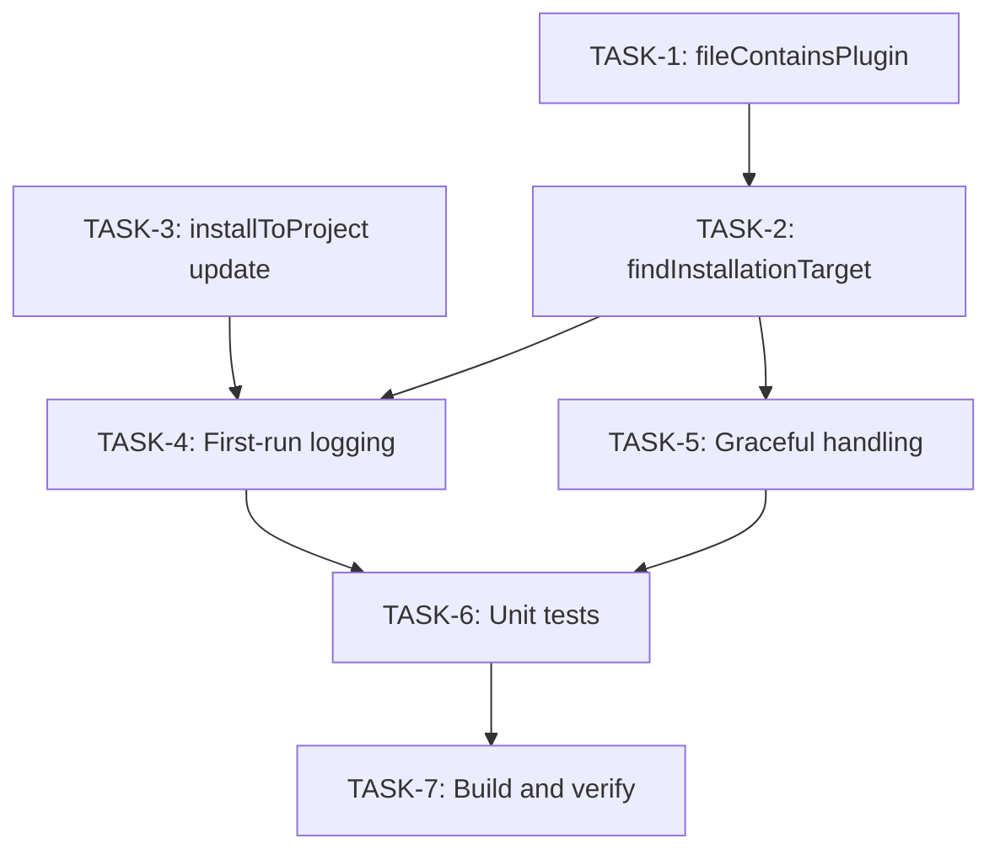

# Implementation Plan: Global-Aware Plugin Installation

**Plan ID**: GLOBAL-AWARE-INSTALL
**Title**: Auto-Detect Installation Location for OpenCode Plugin
**Duration**: 1 day (4-6 hours)
**Status**: Ready for Implementation
**Created**: 2026-01-04
**Specification**: `specs/global-aware-installation/spec.md`

---

## Overview

Modify the ai-eng-system OpenCode plugin (`src/index.ts`) to automatically detect whether to install to global (`~/.config/opencode/`) or project-local (`.opencode/`) location based on which config file references the plugin.

### Current Behavior
```
OpenCode loads plugin → Plugin receives `directory` (project path) → Always installs to {directory}/.opencode/
```

### Target Behavior
```
OpenCode loads plugin → Plugin checks global config first → Installs to whichever location references "ai-eng-system"
```

## Architecture Diagram

```
┌─────────────────────────────────────────────────────────────────────────────┐
│                          OpenCode Plugin Execution                          │
└─────────────────────────────────────────────────────────────────────────────┘
                                      │
                                      ▼
┌─────────────────────────────────────────────────────────────────────────────┐
│  AiEngSystem Plugin Entry Point (src/index.ts)                              │
│  - Receives: { project, client, $, directory, worktree }                    │
└─────────────────────────────────────────────────────────────────────────────┘
                                      │
                                      ▼
┌─────────────────────────────────────────────────────────────────────────────┐
│  findInstallationTarget(projectDir: string): string | null                  │
│                                                                             │
│  Priority 1: Check ~/.config/opencode/opencode.jsonc                        │
│              └─ If exists AND contains "ai-eng-system" → return global path │
│                                                                             │
│  Priority 2: Check {projectDir}/.opencode/opencode.jsonc                    │
│              └─ If exists AND contains "ai-eng-system" → return project path│
│                                                                             │
│  Fallback:   Return null (skip installation)                                │
└─────────────────────────────────────────────────────────────────────────────┘
                                      │
                                      ▼
                    ┌─────────────────┴─────────────────┐
                    │                                   │
                    ▼                                   ▼
        ┌───────────────────┐               ┌───────────────────┐
        │  Global Install   │               │  Project Install  │
        │  ~/.config/       │               │  {project}/       │
        │    opencode/      │               │    .opencode/     │
        │      command/     │               │      command/     │
        │      agent/       │               │      agent/       │
        │      skill/       │               │      skill/       │
        └───────────────────┘               └───────────────────┘
                                      │
                                      ▼
┌─────────────────────────────────────────────────────────────────────────────┐
│  First-Run Logging (only when command/ai-eng/ doesn't exist)                │
│  console.log(`[ai-eng-system] Installed to: ${targetPath}`)                 │
└─────────────────────────────────────────────────────────────────────────────┘
```

## User Story to Task Mapping

| User Story | Tasks | Priority |
|------------|-------|----------|
| US-001: Auto-Detect Installation Location | TASK-1, TASK-2, TASK-3 | HIGH |
| US-002: Always Use Latest Version | (No change - existing behavior) | - |
| US-003: Silent Installation with Initial Log | TASK-4 | MEDIUM |
| US-004: Handle Missing Config Gracefully | TASK-5 | HIGH |

---

## Task Breakdown

### TASK-1: Add fileContainsPlugin Helper Function
**ID**: TASK-1
**Title**: Create helper to check if config file references ai-eng-system
**Priority**: HIGH
**Complexity**: Low
**Time Estimate**: 15 minutes
**Dependencies**: None

**File**: `src/index.ts`

**Description**:
Add a helper function that reads a config file and checks if it contains the string `"ai-eng-system"`. Uses simple string search (no JSONC parsing needed).

**Acceptance Criteria**:
- [ ] Function returns `true` when config contains `"ai-eng-system"`
- [ ] Function returns `false` when config doesn't contain plugin reference
- [ ] Function returns `false` when file doesn't exist
- [ ] Function returns `false` when file can't be read (permissions, etc.)
- [ ] Function handles all edge cases without throwing

**Code Snippet**:
```typescript
/**
 * Check if a config file contains reference to ai-eng-system plugin.
 * Uses simple string search - no JSONC parsing needed.
 */
function fileContainsPlugin(configPath: string): boolean {
    try {
        const content = fs.readFileSync(configPath, "utf-8");
        return content.includes('"ai-eng-system"');
    } catch {
        return false;
    }
}
```

**Test Cases**:
- Config with `"ai-eng-system"` in plugin array → true
- Config without plugin reference → false
- Config file doesn't exist → false
- JSONC file with comments → correctly detects plugin
- Empty file → false

---

### TASK-2: Add findInstallationTarget Function
**ID**: TASK-2
**Title**: Create function to determine installation target directory
**Priority**: HIGH
**Complexity**: Medium
**Time Estimate**: 30 minutes
**Dependencies**: TASK-1

**File**: `src/index.ts`

**Description**:
Add function that checks global and project config locations in priority order and returns the appropriate installation target directory.

**Acceptance Criteria**:
- [ ] Returns global path when global config contains plugin reference
- [ ] Returns project path when only project config contains plugin reference
- [ ] Returns global path when BOTH configs contain plugin reference (global wins)
- [ ] Returns null when neither config contains plugin reference
- [ ] Handles missing HOME environment variable gracefully
- [ ] Works on Windows (USERPROFILE) and Unix (HOME)

**Code Snippet**:
```typescript
/**
 * Find the installation target directory based on which config references the plugin.
 * Priority: global (~/.config/opencode/) > project (.opencode/)
 * 
 * @param projectDir - The project directory passed by OpenCode
 * @returns The target directory for installation, or null if plugin not referenced
 */
function findInstallationTarget(projectDir: string): string | null {
    const homeDir = process.env.HOME || process.env.USERPROFILE || "";
    
    // Priority 1: Check global config
    const globalConfigPath = path.join(homeDir, ".config", "opencode", "opencode.jsonc");
    if (fs.existsSync(globalConfigPath) && fileContainsPlugin(globalConfigPath)) {
        return path.join(homeDir, ".config", "opencode");
    }
    
    // Priority 2: Check project config
    const projectConfigPath = path.join(projectDir, ".opencode", "opencode.jsonc");
    if (fs.existsSync(projectConfigPath) && fileContainsPlugin(projectConfigPath)) {
        return path.join(projectDir, ".opencode");
    }
    
    // No config references the plugin
    return null;
}
```

**Test Cases**:
- Global config only → returns global path
- Project config only → returns project path
- Both configs → returns global path (priority)
- Neither config → returns null
- Global config exists but no plugin ref → checks project
- Missing HOME env var → handles gracefully

---

### TASK-3: Modify installToProject Function
**ID**: TASK-3
**Title**: Update installToProject to accept target directory directly
**Priority**: HIGH
**Complexity**: Low
**Time Estimate**: 20 minutes
**Dependencies**: None (can be done in parallel with TASK-1, TASK-2)

**File**: `src/index.ts`

**Description**:
The current `installToProject` function expects `projectDir` (project root) and internally appends `.opencode/`. Modify it to accept the actual target directory directly (e.g., `~/.config/opencode/` or `{project}/.opencode/`).

**Acceptance Criteria**:
- [ ] Function accepts target directory directly (not project root)
- [ ] Copies commands to `{target}/command/ai-eng/`
- [ ] Copies agents to `{target}/agent/ai-eng/`
- [ ] Copies skills to `{target}/skill/`
- [ ] Backward compatible - existing behavior unchanged when called correctly

**Code Snippet (BEFORE)**:
```typescript
function installToProject(pluginDir: string, projectDir: string): void {
    // ...
    // Target directories
    const targetOpenCodeDir = path.join(projectDir, ".opencode");
    // ...
}
```

**Code Snippet (AFTER)**:
```typescript
/**
 * Install AI Engineering System files to the target directory.
 * 
 * @param pluginDir - The plugin's dist directory (source of files)
 * @param targetDir - The target .opencode directory (e.g., ~/.config/opencode/ or .opencode/)
 */
function installToProject(pluginDir: string, targetDir: string): void {
    // When running from dist/index.js, pluginDir is already the dist directory
    // When running from package root during development, pluginDir is the package root
    const isDistDir = fs.existsSync(path.join(pluginDir, ".opencode"));

    const distDir = isDistDir ? pluginDir : path.join(pluginDir, "dist");
    const distOpenCodeDir = path.join(distDir, ".opencode");
    const NAMESPACE_PREFIX = "ai-eng";

    // Target is now passed directly (not derived from project root)
    const targetOpenCodeDir = targetDir;

    // Copy commands (namespaced under ai-eng/)
    const commandsSrc = path.join(distOpenCodeDir, "command", NAMESPACE_PREFIX);
    if (fs.existsSync(commandsSrc)) {
        const commandsDest = path.join(
            targetOpenCodeDir,
            "command",
            NAMESPACE_PREFIX,
        );
        copyRecursive(commandsSrc, commandsDest);
    }

    // Copy agents (namespaced under ai-eng/)
    const agentsSrc = path.join(distOpenCodeDir, "agent", NAMESPACE_PREFIX);
    if (fs.existsSync(agentsSrc)) {
        const agentsDest = path.join(
            targetOpenCodeDir,
            "agent",
            NAMESPACE_PREFIX,
        );
        copyRecursive(agentsSrc, agentsDest);
    }

    // Copy skills (to .opencode/skill/)
    const distSkillDir = path.join(distDir, ".opencode", "skill");
    if (fs.existsSync(distSkillDir)) {
        const skillDest = path.join(targetOpenCodeDir, "skill");
        copyRecursive(distSkillDir, skillDest);
    }
}
```

**Test Cases**:
- Global target directory → files installed to global
- Project target directory → files installed to project
- Target directory doesn't exist → created automatically

---

### TASK-4: Add First-Run Logging
**ID**: TASK-4
**Title**: Log installation location only on first run
**Priority**: MEDIUM
**Complexity**: Low
**Time Estimate**: 15 minutes
**Dependencies**: TASK-2, TASK-3

**File**: `src/index.ts`

**Description**:
Add logging that outputs the installation location only when files are being installed for the first time (i.e., when `command/ai-eng/` directory doesn't exist in target).

**Acceptance Criteria**:
- [ ] Logs installation location on first run
- [ ] Silent on subsequent runs (when files already exist)
- [ ] Log format: `[ai-eng-system] Installed to: {targetPath}`
- [ ] Errors still logged to console.error

**Code Snippet**:
```typescript
// In the plugin's main function
const targetDir = findInstallationTarget(directory);

if (targetDir) {
    const isFirstRun = !fs.existsSync(path.join(targetDir, "command", "ai-eng"));
    
    try {
        installToProject(pluginDir, targetDir);
        
        if (isFirstRun) {
            console.log(`[ai-eng-system] Installed to: ${targetDir}`);
        }
    } catch (error) {
        console.error(
            `[ai-eng-system] Installation warning: ${error instanceof Error ? error.message : String(error)}`,
        );
    }
}
```

**Test Cases**:
- First run (no existing files) → logs installation location
- Subsequent run (files exist) → no output
- Installation error → logs to stderr

---

### TASK-5: Handle Missing/Invalid Config Gracefully
**ID**: TASK-5
**Title**: Graceful handling when no config references plugin
**Priority**: HIGH
**Complexity**: Low
**Time Estimate**: 10 minutes
**Dependencies**: TASK-2

**File**: `src/index.ts`

**Description**:
When no config file references `ai-eng-system`, the plugin should skip installation silently without errors.

**Acceptance Criteria**:
- [ ] No error when config doesn't exist
- [ ] No error when config exists but doesn't reference plugin
- [ ] Plugin still loads and returns hooks object
- [ ] OpenCode continues to function normally

**Code Snippet**:
```typescript
export const AiEngSystem: Plugin = async ({
    project,
    client,
    $,
    directory,
    worktree,
}) => {
    const pluginDir = path.dirname(new URL(import.meta.url).pathname);
    
    // Find installation target
    const targetDir = findInstallationTarget(directory);
    
    if (!targetDir) {
        // Plugin not referenced in any config - skip installation silently
        return {
            config: async (input: Record<string, unknown>) => {
                // No-op
            },
        };
    }
    
    // Proceed with installation...
};
```

**Test Cases**:
- No config files → plugin loads, no installation
- Config exists without plugin ref → plugin loads, no installation
- Both configs without plugin ref → plugin loads, no installation

---

### TASK-6: Write Unit Tests
**ID**: TASK-6
**Title**: Create comprehensive unit tests for new functions
**Priority**: HIGH
**Complexity**: Medium
**Time Estimate**: 1 hour
**Dependencies**: TASK-1, TASK-2, TASK-3, TASK-4, TASK-5

**File**: `tests/unit.test.ts` (add new describe blocks)

**Description**:
Add unit tests for all new functions using the existing test patterns. Use temp directories and mock HOME environment variable.

**Acceptance Criteria**:
- [ ] Tests for `fileContainsPlugin` function
- [ ] Tests for `findInstallationTarget` function
- [ ] Tests for updated `installToProject` function
- [ ] Tests for first-run detection logic
- [ ] All tests pass with `bun test`

**Code Snippet**:
```typescript
import { describe, expect, it, beforeEach, afterEach } from "bun:test";
import { mkdir, rm, writeFile } from "node:fs/promises";
import { tmpdir } from "node:os";
import { join } from "node:path";

describe("Global-Aware Installation", () => {
    const TEST_DIR = join(tmpdir(), `ai-eng-global-test-${Date.now()}`);
    let originalHome: string | undefined;
    
    beforeEach(async () => {
        originalHome = process.env.HOME;
        await mkdir(TEST_DIR, { recursive: true });
    });
    
    afterEach(async () => {
        process.env.HOME = originalHome;
        await rm(TEST_DIR, { recursive: true, force: true });
    });

    describe("fileContainsPlugin", () => {
        it("should return true when config contains ai-eng-system", async () => {
            const configPath = join(TEST_DIR, "opencode.jsonc");
            await writeFile(configPath, JSON.stringify({
                plugin: ["ai-eng-system", "other-plugin"]
            }));
            
            expect(fileContainsPlugin(configPath)).toBe(true);
        });
        
        it("should return false when config does not contain ai-eng-system", async () => {
            const configPath = join(TEST_DIR, "opencode.jsonc");
            await writeFile(configPath, JSON.stringify({
                plugin: ["other-plugin"]
            }));
            
            expect(fileContainsPlugin(configPath)).toBe(false);
        });
        
        it("should return false when file does not exist", () => {
            expect(fileContainsPlugin("/nonexistent/path")).toBe(false);
        });
        
        it("should handle JSONC with comments", async () => {
            const configPath = join(TEST_DIR, "opencode.jsonc");
            await writeFile(configPath, `{
                // This is a comment
                "plugin": ["ai-eng-system"]
            }`);
            
            expect(fileContainsPlugin(configPath)).toBe(true);
        });
    });

    describe("findInstallationTarget", () => {
        it("should return global path when global config has plugin", async () => {
            const fakeHome = join(TEST_DIR, "home");
            const globalConfig = join(fakeHome, ".config", "opencode");
            await mkdir(globalConfig, { recursive: true });
            await writeFile(join(globalConfig, "opencode.jsonc"), JSON.stringify({
                plugin: ["ai-eng-system"]
            }));
            
            process.env.HOME = fakeHome;
            
            const result = findInstallationTarget("/some/project");
            expect(result).toBe(globalConfig);
        });
        
        it("should return project path when only project config has plugin", async () => {
            const fakeHome = join(TEST_DIR, "home");
            const projectDir = join(TEST_DIR, "project");
            const projectConfig = join(projectDir, ".opencode");
            
            // No global config
            await mkdir(join(fakeHome, ".config", "opencode"), { recursive: true });
            
            // Project config with plugin
            await mkdir(projectConfig, { recursive: true });
            await writeFile(join(projectConfig, "opencode.jsonc"), JSON.stringify({
                plugin: ["ai-eng-system"]
            }));
            
            process.env.HOME = fakeHome;
            
            const result = findInstallationTarget(projectDir);
            expect(result).toBe(projectConfig);
        });
        
        it("should return global path when both configs have plugin (global wins)", async () => {
            const fakeHome = join(TEST_DIR, "home");
            const globalConfig = join(fakeHome, ".config", "opencode");
            const projectDir = join(TEST_DIR, "project");
            const projectConfig = join(projectDir, ".opencode");
            
            // Both have plugin
            await mkdir(globalConfig, { recursive: true });
            await writeFile(join(globalConfig, "opencode.jsonc"), JSON.stringify({
                plugin: ["ai-eng-system"]
            }));
            
            await mkdir(projectConfig, { recursive: true });
            await writeFile(join(projectConfig, "opencode.jsonc"), JSON.stringify({
                plugin: ["ai-eng-system"]
            }));
            
            process.env.HOME = fakeHome;
            
            const result = findInstallationTarget(projectDir);
            expect(result).toBe(globalConfig);
        });
        
        it("should return null when neither config has plugin", async () => {
            const fakeHome = join(TEST_DIR, "home");
            const projectDir = join(TEST_DIR, "project");
            
            // Neither config exists
            process.env.HOME = fakeHome;
            
            const result = findInstallationTarget(projectDir);
            expect(result).toBeNull();
        });
    });
});
```

**Test Matrix**:

| Test Case | fileContainsPlugin | findInstallationTarget |
|-----------|-------------------|------------------------|
| Plugin present | true | - |
| Plugin absent | false | - |
| File missing | false | - |
| JSONC with comments | true | - |
| Global only | - | global path |
| Project only | - | project path |
| Both (global wins) | - | global path |
| Neither | - | null |
| Missing HOME var | - | handles gracefully |

---

### TASK-7: Update Build and Verify
**ID**: TASK-7
**Title**: Rebuild and verify dist/index.js
**Priority**: HIGH
**Complexity**: Low
**Time Estimate**: 10 minutes
**Dependencies**: TASK-1 through TASK-5

**Commands**:
```bash
bun run build
bun test
```

**Acceptance Criteria**:
- [ ] `bun run build` succeeds
- [ ] `dist/index.js` is updated with new logic
- [ ] All existing tests pass
- [ ] New tests pass
- [ ] No TypeScript errors

---

## Dependency Graph



## Execution Order

| Order | Task | Time Est. | Dependencies |
|-------|------|-----------|--------------|
| 1 | TASK-1: fileContainsPlugin | 15 min | None |
| 2 | TASK-3: installToProject update | 20 min | None (parallel with TASK-1) |
| 3 | TASK-2: findInstallationTarget | 30 min | TASK-1 |
| 4 | TASK-5: Graceful handling | 10 min | TASK-2 |
| 5 | TASK-4: First-run logging | 15 min | TASK-2, TASK-3 |
| 6 | TASK-6: Unit tests | 60 min | All above |
| 7 | TASK-7: Build and verify | 10 min | TASK-6 |
| **Total** | | **~2.5 hours** | |

---

## Test Plan

### Unit Tests

| Test ID | Description | Input | Expected Output |
|---------|-------------|-------|-----------------|
| UT-01 | fileContainsPlugin with plugin present | Config with `"ai-eng-system"` | true |
| UT-02 | fileContainsPlugin with plugin absent | Config without plugin | false |
| UT-03 | fileContainsPlugin with missing file | Non-existent path | false |
| UT-04 | fileContainsPlugin with JSONC comments | Config with `// comments` | true |
| UT-05 | fileContainsPlugin with empty file | Empty file | false |
| UT-06 | findInstallationTarget global only | Global config has plugin | Global path |
| UT-07 | findInstallationTarget project only | Project config has plugin | Project path |
| UT-08 | findInstallationTarget both configs | Both have plugin | Global path |
| UT-09 | findInstallationTarget neither config | Neither has plugin | null |
| UT-10 | findInstallationTarget missing HOME | HOME not set | Handles gracefully |

### Integration Tests

| Test ID | Description | Setup | Expected Behavior |
|---------|-------------|-------|-------------------|
| IT-01 | Global installation | Global config with plugin | Files in ~/.config/opencode/ |
| IT-02 | Project installation | Project config with plugin | Files in .opencode/ |
| IT-03 | First-run logging | Fresh install | Console logs location |
| IT-04 | Subsequent run silent | Files already exist | No console output |
| IT-05 | No config | Neither config exists | No errors, plugin loads |

### Manual Validation

```bash
# Test 1: Global installation
echo '{"plugin": ["ai-eng-system"]}' > ~/.config/opencode/opencode.jsonc
rm -rf ~/.config/opencode/command/ai-eng
# Run OpenCode, verify:
# - [ai-eng-system] Installed to: ~/.config/opencode
# - Files exist in ~/.config/opencode/command/ai-eng/

# Test 2: Project installation
rm ~/.config/opencode/opencode.jsonc  # Remove global
mkdir -p .opencode
echo '{"plugin": ["ai-eng-system"]}' > .opencode/opencode.jsonc
rm -rf .opencode/command/ai-eng
# Run OpenCode, verify:
# - [ai-eng-system] Installed to: .opencode
# - Files exist in .opencode/command/ai-eng/

# Test 3: Subsequent run (silent)
# Run OpenCode again, verify:
# - No installation log output

# Test 4: No config
rm .opencode/opencode.jsonc
# Run OpenCode, verify:
# - No errors
# - Plugin loads normally
```

---

## Risk Assessment

| Risk | Likelihood | Impact | Mitigation |
|------|------------|--------|------------|
| Breaking change for existing users | Low | High | Change is backward-compatible; users with project config still get project install |
| Permission errors on global directory | Medium | Medium | Catch and log error, don't crash plugin |
| Race condition if multiple projects load simultaneously | Low | Low | Each plugin instance operates independently |
| HOME env var missing on some systems | Low | Medium | Fallback to USERPROFILE, then empty string |
| JSONC parsing issues | Low | Medium | Using simple string search, not JSON parsing |

---

## Success Criteria

- [ ] Plugin detects installation location based on `opencode.jsonc` presence
- [ ] Plugin installs to `~/.config/opencode/` when global config references plugin
- [ ] Plugin installs to `.opencode/` when project config references plugin
- [ ] Plugin prefers global config over project when both exist
- [ ] All files are overwritten on each installation (existing behavior maintained)
- [ ] Installation location is logged on first run only
- [ ] Plugin handles missing configs gracefully (no errors)
- [ ] `bun run build` produces working plugin in `dist/index.js`
- [ ] All new tests pass
- [ ] All existing tests continue to pass

---

## Validation Checklist

After implementation, verify:

1. **Code Changes**
   - [ ] `fileContainsPlugin` function added
   - [ ] `findInstallationTarget` function added
   - [ ] `installToProject` updated to accept target directory
   - [ ] Main plugin logic updated
   - [ ] First-run logging implemented

2. **Build**
   - [ ] `bun run build` succeeds
   - [ ] No TypeScript errors
   - [ ] `dist/index.js` updated

3. **Tests**
   - [ ] All new unit tests pass
   - [ ] All existing tests pass
   - [ ] Manual validation complete

4. **Documentation**
   - [ ] Spec marked as implemented
   - [ ] Any README updates if needed

---

## Implementation Notes

### Why String Search Instead of JSONC Parsing

The spec explicitly states to use simple string search (`content.includes('"ai-eng-system"')`) instead of JSONC parsing because:
1. No need to add JSONC parser dependency
2. Simpler and faster
3. Works correctly for all valid config formats
4. The plugin name is always quoted in JSON, so string search is reliable

### Priority Order Rationale

Global config takes precedence over project config because:
1. Users who set up global installation explicitly want it to be global
2. Prevents duplicate installations across projects
3. Matches the documented user expectation in the spec

### Backward Compatibility

This change is backward compatible because:
1. Users with only project config → still get project install (same as before)
2. Users with global config → now get global install (new behavior, but expected)
3. No breaking changes to the plugin API or file structure

---

## References

- Specification: `specs/global-aware-installation/spec.md`
- Reference Implementation: `scripts/install.js` (lines 28-74)
- Current Plugin: `src/index.ts`
- Test Patterns: `tests/unit.test.ts`
- Build Process: `build.ts`

---

**Plan Created**: 2026-01-04
**Last Updated**: 2026-01-04
**Status**: Ready for Implementation
**Next Action**: Start implementation of TASK-1 (fileContainsPlugin function)
